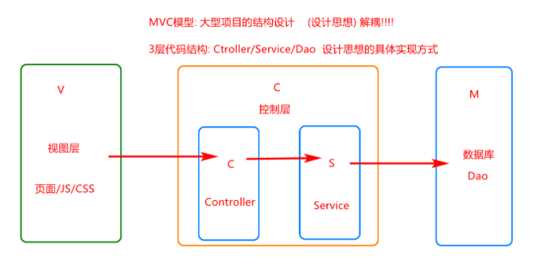
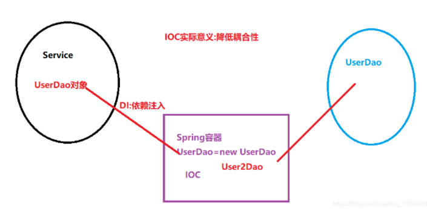

<h1>干货</h1>

                                                 By:会飞的鱼  
                                                 Wx:context_getBean  
                                                 Qq:2834437260  
# 框架  
#### 1.什么是框架?  
将公共的模块(功能)进行高级抽取(接口/父级)形成了通用的代码体   
#### 2.如何使用框架?  
引入特定的jar包/class方法    
#### 3.使用框架的意义?  
简化代码的开发 提高软件的**扩展性**
## Spring  
**Spring框架是一个开源的**j2EE应用程序框架,主要的作用是**将其他框架进行整合**通过对**bean的生命周期进行管理的轻量级容器,并提供了功能强大的IOC、AOP及Web MVC...**  
**Bean:spring容器管理的对象都称之为Bean**
**Spring会自动管理Bean,无需手动完成对象的创建及销毁,只需要调用Spring去完成**
### MVC模型  

#### 1.M(Model) 持久层   
代码与数据库进行交互的代码(Mybatis-dao层)
#### 2.C(Control) 控制层  
完成业务的功能的具体操作层 功能的实现层(Controller---Service层)
#### 3.V(View) 视图层  
一般指前端可视化内容(页面)

### IOC  
#### 说明  
**控制反转(Inversion of Control , IOC)**
摒弃了传统通过new对象的方式来创建对象 增加了代码的扩展性 降低了程序的耦合
**将程序的创建权利交给Spring管理** 由spring完成对象的创建/初始化/使用/销毁

### jar包
````
# code block

<dependencies>
        <!--Spring核心包-->
        <dependency>
            <groupId>org.springframework</groupId>
            <artifactId>spring-core</artifactId>
            <version>5.3.6</version>
        </dependency>

        <!--引入SpringBean-->
        <dependency>
            <groupId>org.springframework</groupId>
            <artifactId>spring-beans</artifactId>
            <version>5.3.6</version>
        </dependency>

        <!--引入context包-->
        <dependency>
            <groupId>org.springframework</groupId>
            <artifactId>spring-context</artifactId>
            <version>5.3.6</version>
        </dependency>

        <!--引入表达式jar包-->
        <dependency>
            <groupId>org.springframework</groupId>
            <artifactId>spring-expression</artifactId>
            <version>5.3.6</version>
        </dependency>

        <!--引入日志依赖-->
        <dependency>
            <groupId>commons-logging</groupId>
            <artifactId>commons-logging</artifactId>
            <version>1.2</version>
        </dependency>

        <!--引入测试包-->
        <dependency>
            <groupId>junit</groupId>
            <artifactId>junit</artifactId>
            <version>4.12</version>
        </dependency>
    </dependencies>
````
### 工作原理
Spring执行时,通过对application.xml文件进行解析  
当解析到bean标签时,会根据反射机制实例化对象  
将创建好的对象放入一个超大Map集合中,通过getBean中的id获取对象
Map<id,对象> key=id value=对象  
通过反射创建对象 会调用对象的无参构造函数

### 工厂模式  


### 单例多例 scope属性  
### 懒加载  
### 生命周期  
### 三层代码结构  


### 依赖注入  
对象中的**属性**,**应该由spring容器动态赋值**
### 公共集合编辑  